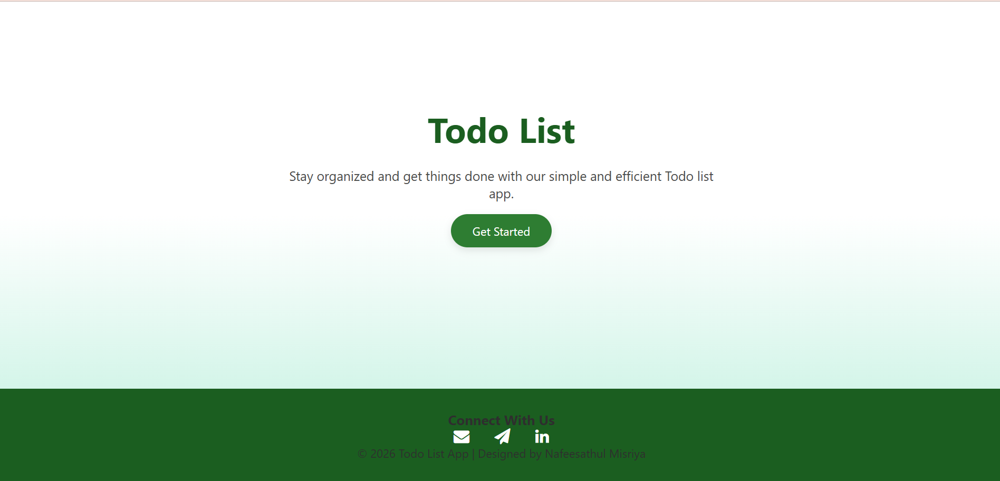
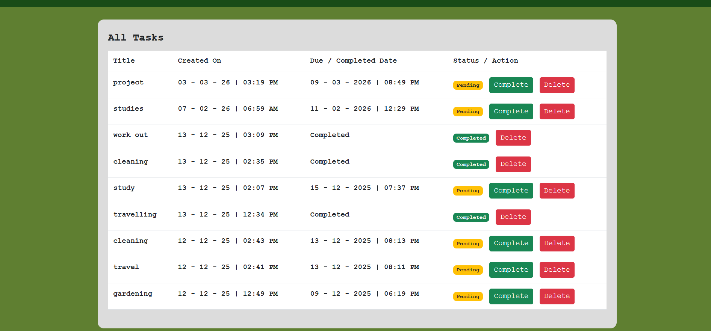
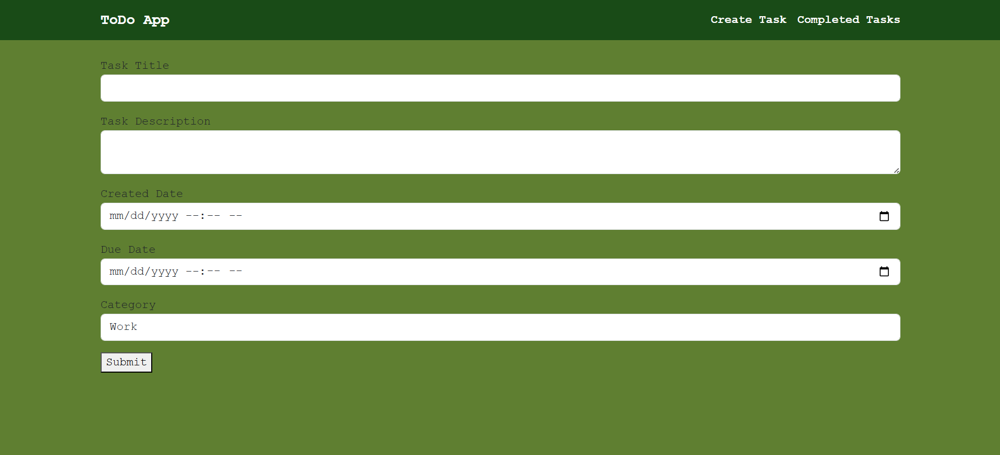

📝 To-Do App
📖 Project Description

The To-Do App is a web-based task management system developed using Python and Django. This application helps users organize and manage their daily tasks effectively. Users can create tasks, update them, mark them as completed, and track their progress through an easy-to-use interface.
The system also includes user authentication, allowing users to register, log in securely, and manage their own tasks. Each task can be assigned a start date and due date, helping users plan and complete their activities within the scheduled time.
This application improves productivity by helping users keep track of pending and completed tasks in a structured manner.

✨ Features
🔐 User Authentication:

User Signup / Registration
Secure Login and Logout
Each user manages their own tasks

📋 Task Management:
Create new tasks
View all tasks
View task details

✏️ Task Editing:
Update/Edit tasks
Modify task information anytime

🗑 Task Deletion:
Delete tasks that are no longer required

📅 Task Scheduling:
Assign Start Date
Assign Due Date
Helps users manage deadlines

✅ Task Completion:
Mark tasks as Completed
View completed tasks separately

🎨 User Friendly Interface:
Simple and clean interface for easy task management

🛠 Technologies Used:
Frontend
HTML
CSS

Backend:
Python-Django Framework

Database-SQLite

🎯 Project Objective:
The objective of this project is to develop a simple and efficient task management system that allows users to organize their daily activities, set deadlines, and track completed tasks through a web-based platform.

## Screenshots

### Home Page

### Task List

### Create Task

